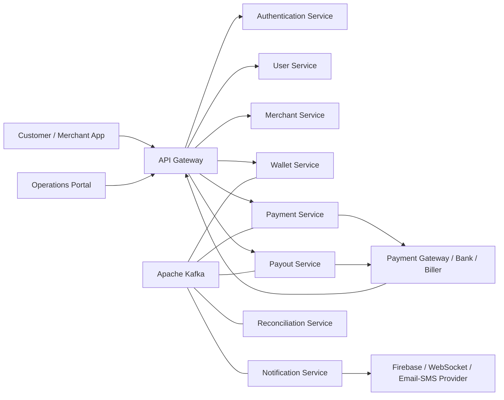
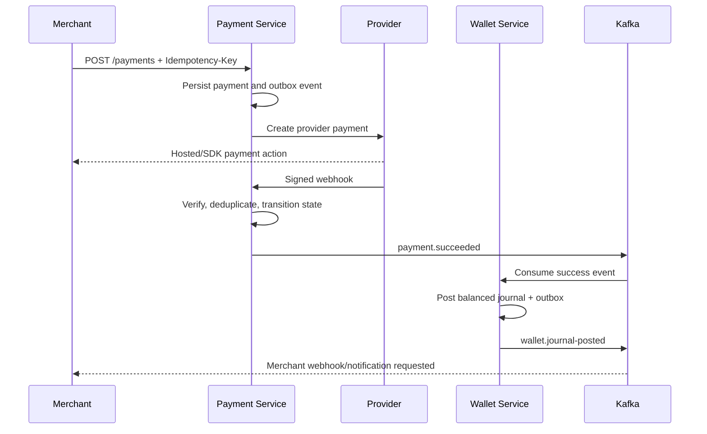
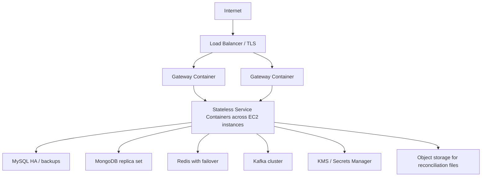

# QPay Architecture and Design

**Status:** Initial design  
**Platform:** Java 17, Spring Boot, Kafka, MySQL, MongoDB, Redis, Docker, AWS EC2  
**Purpose:** Technical source of truth for QPay's payment gateway and wallet platform

## 1. Goals and scope

QPay provides secure merchant onboarding, Pay-In, Pay-Out, wallet accounting, utility payments, transaction tracking, reconciliation, and notifications. The platform is designed for horizontal scalability, auditable money movement, safe retries, and graceful handling of external provider failures.

### Core principles

- Each service owns its data; other services use APIs or events rather than direct database access.
- Every money movement is represented by balanced, immutable double-entry ledger postings.
- Mutating public APIs, provider requests, and webhook handlers are idempotent.
- Synchronous calls are used only when an immediate answer is required; Kafka carries asynchronous state changes.
- Distributed workflows use sagas and compensating actions rather than cross-service database transactions.
- Sensitive banking data is encrypted and never placed in logs, Kafka events, or client-visible error messages.
- Transaction state transitions are explicit, validated, and auditable.

### Initial assumptions

- All monetary amounts are stored in minor units (`BIGINT`), never floating point.
- Every transaction has exactly one currency in ISO 4217 format.
- The first deployment uses Docker containers on AWS EC2; the design remains portable to a managed container platform.
- QPay integrates with multiple payment gateways, banks, billers, Firebase, and webhook consumers through adapter interfaces.

## 2. System context



The API Gateway is the only public entry point. Provider webhooks enter through dedicated gateway routes and are validated again inside the owning service.

## 3. Service responsibilities

| Service | Responsibilities | Primary store |
|---|---|---|
| API Gateway | Routing, TLS termination, request IDs, coarse rate limits, token validation, allowlists, response headers | Redis for distributed rate limiting |
| Authentication | Login, refresh/logout, password policy, MFA extension point, JWT issuance, token revocation, roles and permissions | MySQL + Redis |
| User | Customer profile, status, contact details, KYC references and preferences | MySQL |
| Merchant | Merchant profile, onboarding, KYB status, API credentials, webhook configuration, limits and pricing references | MySQL |
| Wallet | Wallets, available/held balances, immutable journal, ledger entries, holds, releases and settlement postings | MySQL |
| Payment | Pay-In and utility-payment orchestration, provider routing, payment attempts, callback/webhook processing | MySQL |
| Payout | Beneficiaries, payout orchestration, bank requests, status tracking and reversals | MySQL |
| Notification | Templates, delivery preferences, WebSocket sessions, Firebase and other channel delivery, retry/dead-letter handling | MongoDB + Redis |
| Reconciliation | Provider-file/API ingestion, internal-versus-provider matching, discrepancies, settlement reports and resolution workflow | MySQL + object storage |

No service may update another service's tables. Reporting views should be built from events or read APIs, not joins across service databases.

## 4. Internal structure

Each service follows a ports-and-adapters structure:

```text
api          REST controllers, DTOs, validation, exception mapping
application  use cases, commands, queries, transaction boundaries
domain       aggregates, value objects, policies, state machines
ports        repository, message, clock and provider interfaces
adapters     JPA/Mongo/Redis, Kafka, HTTP clients, external providers
config       security, serialization, resilience and observability
```

Domain logic must not depend on Spring MVC, Kafka, JPA, or a specific external provider SDK.

## 5. Data ownership and core model

### Wallet and ledger

The Wallet Service is the authority for financial balances. A cached balance is never the accounting source of truth.

Key records:

- `wallet`: owner, currency, status, version, available and held balance projections.
- `ledger_account`: chart-of-account entry such as merchant payable, cash at provider, fee revenue, payout clearing, or suspense.
- `journal`: one business transaction with reference, type, status and idempotency key.
- `ledger_entry`: immutable debit or credit belonging to a journal and ledger account.
- `fund_hold`: reservation of available funds for a payout or other delayed operation.
- `outbox_event`: event committed in the same database transaction as the ledger change.

Ledger invariants:

1. Total debits equal total credits for every posted journal and currency.
2. Posted entries are immutable; corrections use reversing and replacement journals.
3. A wallet cannot spend beyond its allowed available balance.
4. A business reference and operation type can post at most once.
5. Wallet updates use optimistic locking or ordered row locks to prevent lost updates.

Example Pay-In posting after provider confirmation:

| Account | Debit | Credit |
|---|---:|---:|
| Cash/receivable at payment provider | 1,000.00 | 0.00 |
| Merchant payable | 0.00 | 980.00 |
| QPay fee revenue | 0.00 | 20.00 |

Example payout reservation and completion:

- Reservation moves the requested amount from the merchant's available projection to held funds.
- Completion debits merchant payable and credits payout clearing/bank cash, with separate balanced fee entries.
- Failure releases the hold; it does not create a payout debit.

### Payment state machine

```text
CREATED -> PROCESSING -> REQUIRES_ACTION -> PROCESSING
PROCESSING -> SUCCEEDED
PROCESSING -> FAILED
CREATED/REQUIRES_ACTION -> EXPIRED
SUCCEEDED -> REFUND_PENDING -> PARTIALLY_REFUNDED/REFUNDED
```

Terminal or backward transitions are rejected unless the operation is an explicit refund or reconciliation correction.

### Payout state machine

```text
CREATED -> FUNDS_HELD -> SUBMITTED -> PROCESSING -> SUCCEEDED
CREATED/FUNDS_HELD/SUBMITTED/PROCESSING -> FAILED
FUNDS_HELD -> CANCELLED
FAILED/CANCELLED -> FUNDS_RELEASED
```

## 6. API design

Base path: `/api/v1`. JSON uses ISO-8601 UTC timestamps and ISO currency codes. Amount objects contain `amountMinor` and `currency`.

Representative endpoints:

| Method and path | Owner | Purpose |
|---|---|---|
| `POST /auth/login` | Authentication | Authenticate and issue token pair |
| `POST /auth/refresh` | Authentication | Rotate refresh token and issue access token |
| `POST /merchants` | Merchant | Begin merchant onboarding |
| `POST /merchants/{id}/api-keys` | Merchant | Create a scoped API credential |
| `GET /wallets/{id}` | Wallet | Retrieve wallet and balance projection |
| `GET /wallets/{id}/transactions` | Wallet | Paginated statement |
| `POST /payments` | Payment | Create a Pay-In |
| `GET /payments/{id}` | Payment | Retrieve canonical payment state |
| `POST /payments/{id}/refunds` | Payment | Request full or partial refund |
| `POST /utility-payments` | Payment | Initiate bill/utility payment |
| `POST /beneficiaries` | Payout | Register a payout beneficiary |
| `POST /payouts` | Payout | Create payout and begin saga |
| `GET /payouts/{id}` | Payout | Retrieve payout state |
| `POST /webhooks/providers/{provider}` | Payment/Payout | Receive provider notification |
| `GET /transactions/{reference}` | Gateway/read model | Track a transaction by reference |

All state-changing merchant endpoints require `Idempotency-Key`. The service stores the key scoped by merchant and operation with a canonical request hash, status, resource ID, and response. Reusing a key with a different payload returns `409 Conflict`.

Standard error shape:

```json
{
  "code": "INSUFFICIENT_FUNDS",
  "message": "The wallet has insufficient available funds.",
  "requestId": "01J...",
  "timestamp": "2026-08-08T12:00:00Z",
  "details": []
}
```

OpenAPI specifications are versioned with the owning service. Breaking changes require a new API version or a documented migration window.

## 7. Event-driven architecture

Kafka topic convention: `qpay.<domain>.<event>.v1`. Events use an envelope containing:

```json
{
  "eventId": "uuid",
  "eventType": "payment.succeeded",
  "eventVersion": 1,
  "occurredAt": "2026-08-08T12:00:00Z",
  "producer": "payment-service",
  "correlationId": "uuid",
  "causationId": "uuid",
  "aggregateId": "payment-id",
  "payload": {}
}
```

Principal events include:

- `merchant.onboarding.completed.v1`
- `payment.created.v1`, `payment.succeeded.v1`, `payment.failed.v1`
- `wallet.funds-held.v1`, `wallet.funds-released.v1`, `wallet.journal-posted.v1`
- `payout.created.v1`, `payout.submitted.v1`, `payout.succeeded.v1`, `payout.failed.v1`
- `refund.succeeded.v1`
- `reconciliation.discrepancy-detected.v1`
- `notification.delivery-requested.v1`

Delivery is at least once. Consumers must use `eventId` or a business operation key for deduplication. Ordering is guaranteed only per aggregate by using its ID as the Kafka message key.

The transactional outbox pattern prevents database updates from succeeding without their corresponding event. An outbox publisher sends events to Kafka and marks them published. Consumers that update a database use an inbox/deduplication table in the same local transaction.

Schema compatibility is backward compatible within a topic version. Sensitive personal, card, bank, token, or credential data is prohibited in event payloads.

## 8. Key workflows

### Pay-In



The client redirect is not proof of payment. Only a verified provider callback, webhook, or authoritative status query may confirm success.

### Payout saga

1. Payout Service validates the request and creates `CREATED`.
2. Wallet Service handles the hold command and emits `wallet.funds-held` or rejection.
3. Payout Service transitions to `FUNDS_HELD`, submits to the bank with its own idempotency reference, and records the attempt.
4. Provider acceptance moves the payout to `SUBMITTED/PROCESSING`; final provider confirmation moves it to `SUCCEEDED`.
5. Wallet Service posts the final payout journal after success.
6. A definite provider failure triggers release of the hold. An uncertain timeout remains pending and is resolved by status polling/reconciliation rather than blindly retried.

Saga state and commands are persisted. Reprocessing the same event or command produces the same outcome.

### Reconciliation

- Import provider transactions and settlement reports through versioned adapters.
- Normalize external records and match by provider reference, QPay reference, amount, currency, and date window.
- Classify records as matched, amount mismatch, status mismatch, missing internally, or missing externally.
- Automatically resolve safe timing differences; place unresolved funds in a suspense account and create an operations case.
- Record every manual action with actor, reason, old value, new value, and timestamp.

## 9. Security design

- TLS is required externally and for service traffic carrying sensitive data.
- Authentication Service issues short-lived signed JWT access tokens and rotating refresh tokens.
- JWT claims include subject, merchant/user ID, roles, scopes, issuer, audience, token ID, issue time and expiry.
- Gateway performs preliminary token checks; each service independently enforces authorization.
- Roles include `CUSTOMER`, `MERCHANT_USER`, `MERCHANT_ADMIN`, `OPS`, `FINANCE`, and `SUPER_ADMIN`; high-risk operations require narrow permissions and audit logs.
- Merchant API keys are displayed once and stored only as strong hashes; keys have scopes, expiry, rotation, revocation and last-used metadata.
- Banking fields are encrypted at application level with envelope encryption. Keys belong in AWS KMS/Secrets Manager, not configuration files.
- Passwords use an adaptive password hash. Refresh tokens and reset tokens are stored hashed.
- Provider webhooks require signature verification over the raw request body, timestamp tolerance, constant-time comparison, replay protection and IP allowlisting where supported.
- Logs redact authorization headers, credentials, bank details, personal identifiers and provider payload secrets.
- Administrative and financial actions generate immutable audit records.
- Rate limits are applied by identity, merchant, route and source IP, with stricter limits for authentication and payout endpoints.

## 10. Resilience and consistency

- External clients use connect/read timeouts, bounded retries with exponential backoff and jitter, and circuit breakers.
- Automatic retries are limited to idempotent calls or calls carrying a provider-supported idempotency key.
- Bulkheads isolate providers and critical thread pools.
- Kafka consumers use bounded retries and dead-letter topics; operational alerts include correlation and event IDs.
- Unknown provider outcomes are represented explicitly as `PENDING/UNKNOWN`, never guessed as failed.
- Redis improves reads, rate limiting and short-lived coordination, but correctness never depends on cached data.
- Cache-aside entries use TTLs and are invalidated after authoritative changes.
- MySQL indexes cover unique business references, idempotency keys, provider references, wallet plus creation time, and status plus update time.
- HikariCP pools are sized from database capacity and container count, not left unbounded.
- Pagination is mandatory for transaction, audit and reconciliation lists; cursor pagination is preferred for high-volume tables.

## 11. Observability and operations

Every request and event carries `requestId`, `correlationId` and, where relevant, `transactionId`. Services emit structured JSON logs and expose health and metrics endpoints.

Minimum telemetry:

- API latency, throughput and error rate by route and status.
- Payment/payout success, failure, pending duration and provider latency.
- Ledger posting failures and invariant violations.
- Kafka consumer lag, retries and dead-letter counts.
- Circuit-breaker state and provider timeout rate.
- Database pool utilization, slow queries and lock contention.
- Reconciliation mismatches and aged unresolved cases.

Alerts focus on customer or financial impact. Health endpoints distinguish liveness from readiness; readiness fails when a service cannot safely accept work.

## 12. Deployment topology



- Images are built once, scanned, tagged immutably and promoted between environments.
- Containers run as non-root with read-only filesystems where possible and expose only required ports.
- Services are stateless and horizontally scalable; singleton work uses partition ownership or distributed scheduling.
- Separate development, test, staging and production environments use distinct credentials and data.
- Database migrations run as controlled deployment steps using Flyway or Liquibase.
- Rolling deployments require backward-compatible API, event and database changes.
- Backups are encrypted, retention is documented, and restore procedures are tested.

## 13. Non-functional targets

Initial targets, to be validated by load testing and business requirements:

| Attribute | Initial target |
|---|---|
| Availability | 99.9% monthly for core payment APIs |
| API latency | p95 under 300 ms excluding external provider time |
| Durability | No loss of acknowledged ledger postings |
| Recovery point | 5 minutes or better for transactional stores |
| Recovery time | 60 minutes or better for core services |
| Audit retention | Configurable to regulatory and business requirements |
| Scale | Horizontal service/consumer scaling by CPU, latency and Kafka lag |

Performance targets do not relax ledger correctness, security, or auditability.

## 14. Testing strategy

- Unit tests for domain policies, state transitions, fees and ledger balancing.
- Property-based tests asserting that generated journals always balance.
- Integration tests with Testcontainers for MySQL, MongoDB, Redis and Kafka.
- Consumer-driven contract tests for synchronous APIs and event schemas.
- Provider adapter tests against sandboxes plus recorded failure scenarios.
- End-to-end tests for Pay-In, payout, timeout recovery, duplicate requests, duplicate/out-of-order webhooks and reconciliation.
- Concurrency tests for simultaneous wallet debits and idempotent retries.
- Security tests for broken access control, replay attacks, signature validation, secret leakage and rate limits.
- Load and soak tests using production-like traffic distribution.

## 15. Delivery roadmap

1. Establish shared engineering standards, local Docker infrastructure, CI, service templates and observability.
2. Deliver Authentication, User and Merchant onboarding with authorization and audit logging.
3. Deliver Wallet Service with chart of accounts, balanced journals, holds and statement APIs.
4. Deliver one Pay-In provider adapter, idempotent webhooks and wallet settlement posting.
5. Deliver Payout saga, beneficiary security and one banking adapter.
6. Deliver notifications, merchant webhooks and WebSocket transaction status.
7. Deliver reconciliation ingestion, matching, discrepancy workflow and reports.
8. Add utility-payment adapters, additional providers, advanced routing and operational tooling.
9. Validate disaster recovery, penetration testing, performance and production readiness.

## 16. Architecture decisions to finalize

- Exact regulatory jurisdiction, retention periods, KYC/KYB obligations and data residency.
- Whether card data is fully hosted/tokenized by a PCI-compliant provider; QPay should avoid storing raw PAN/CVV.
- Kafka and database managed-service choices versus self-management on EC2.
- Fee calculation ownership and versioning rules.
- Multi-currency conversion and foreign-exchange accounting requirements.
- Merchant settlement schedule, reserves, chargebacks and dispute workflows.
- Required RPO/RTO, availability SLOs and peak transaction volume.
- Webhook delivery policy, retry schedule, signing-key rotation and merchant endpoint suspension rules.

These decisions should be captured as individual Architecture Decision Records under `docs/adr/` before implementation depends on them.
